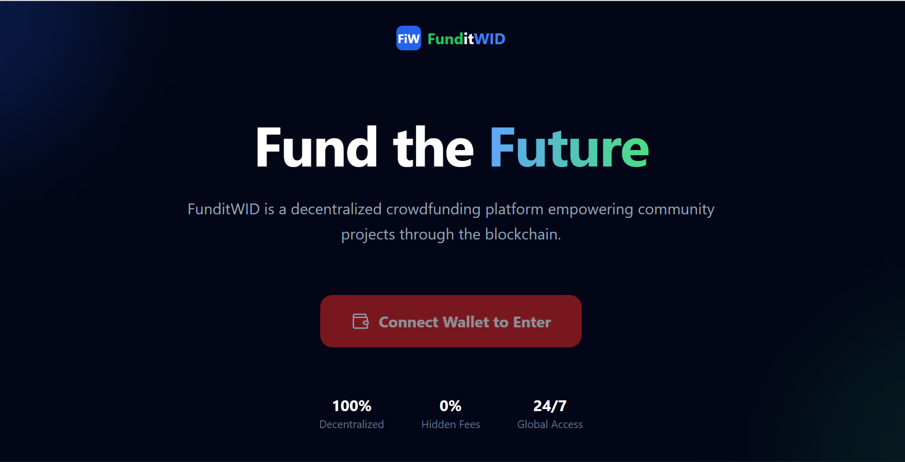
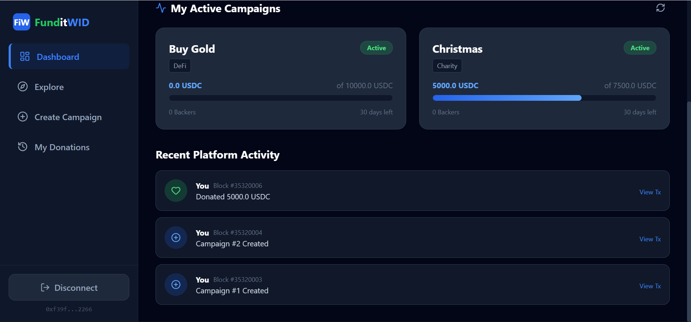
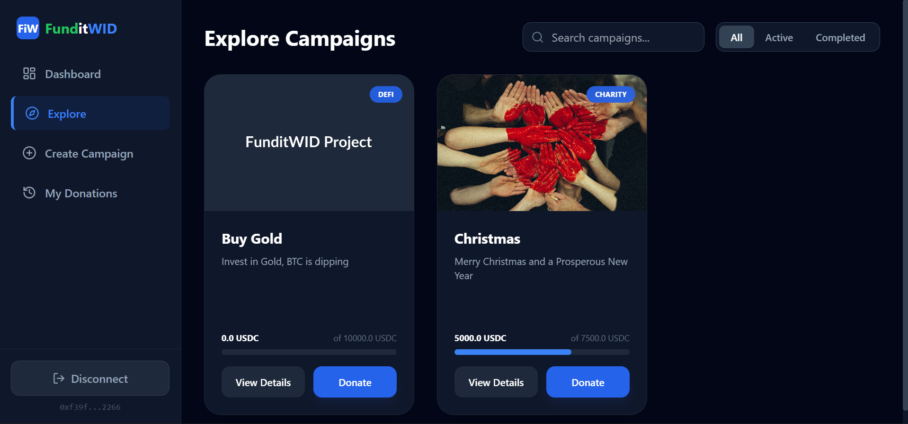

# FunditWID - Decentralized Crowdfunding Platform

FunditWID is a blockchain-based crowdfunding application that allows users to create campaigns, donate using **ERC20 Stablecoins (USDC)**, and track their contributions transparently. Built for the Web3 community to ensure secure, uncapped, and transparent fundraising.



Repo Link: [https://github.com/rayeberechi/funditwid-crowdfund-dapp.git](https://github.com/rayeberechi/funditwid-crowdfund-dapp.git)

Live Link: [FunditWID](https://funditwid.vercel.app/)
## Key Features
- **Create Campaigns:** Users can launch fundraising campaigns with a Title, Description, Image, Goal (in USDC), and Duration.
- **ERC20 Donations:** Supports stablecoin contributions (simulated USDC) instead of volatile ETH.
- **Real-Time Dashboard:** Track your active campaigns, total raised, and recent platform activity.
- **Transparent History:** "My Donations" page tracks every contribution on the blockchain.
- **Live Currency Rates:** Auto-converts USDC balances to NGN/USD using live CoinGecko APIs.

## Application Preview
| Explore Page | Dashboard Page |
|:---:|:---:|
|  |  |

## Tech Stack
- **Frontend:** React, Vite, Tailwind CSS, Lucide Icons
- **Blockchain Interaction:** Ethers.js v6
- **Smart Contracts:** Solidity (Hardhat Environment)
- **Token Standard:** ERC20 (MockUSDC for testing)

---

## How to Run Locally

Follow these steps to set up the project on your machine.

### 1. Prerequisites
- Node.js (v18+)
- MetaMask Wallet Extension

### 2. Clone the Repository
```bash
git clone https://github.com/rayeberechi/funditwid-crowdfund-dapp.git
cd funditwid-crowdfund-dapp
```

### 3. Setup the Backend (Blockchain)
* Open a terminal and navigate to the backend folder:

```Bash
cd backend
npm install
```
* Start the Local Blockchain:

```Bash
npx hardhat node
```
_Keep this terminal running! It gives you 20 test accounts with fake ETH._

* Deploy Smart Contracts: Open a second terminal inside backend:

```Bash
npx hardhat run scripts/deploy.js --network localhost
```
_This will generate the contract-address.json and ABIs needed for the frontend._

### 4. Setup the Frontend
* Open a third terminal and navigate to the frontend folder:

```Bash
cd ../frontend
npm install
npm run dev
```
_Open the localhost link (usually http://localhost:5173) in your browser._

### 5. Connect MetaMask
* Open MetaMask and switch network to Localhost 8545.
- Chain ID: 31337
- Currency Symbol: ETH

* Import an Account from the npx hardhat node terminal (use the Private Key of Account #0).

## Smart Contract Details
* **Crowdfunding.sol:** Handles campaign creation, donations, and withdrawals.

* **MockToken.sol:** A standard ERC20 token minted to the deployer to simulate USDC.

## To Contribute
1. Fork the repo

2. Create your feature branch (git checkout -b feature/AmazingFeature)

3. Commit your changes (git commit -m 'Add some AmazingFeature')

4. Push to the branch (git push origin feature/AmazingFeature)

5. Open a Pull Request

## Team 
* Smart Contract: Defi Nurse 
* Frontend: Jemmy & Faithy 
* Integration: Faithy
* Documentation: Jumoke
---